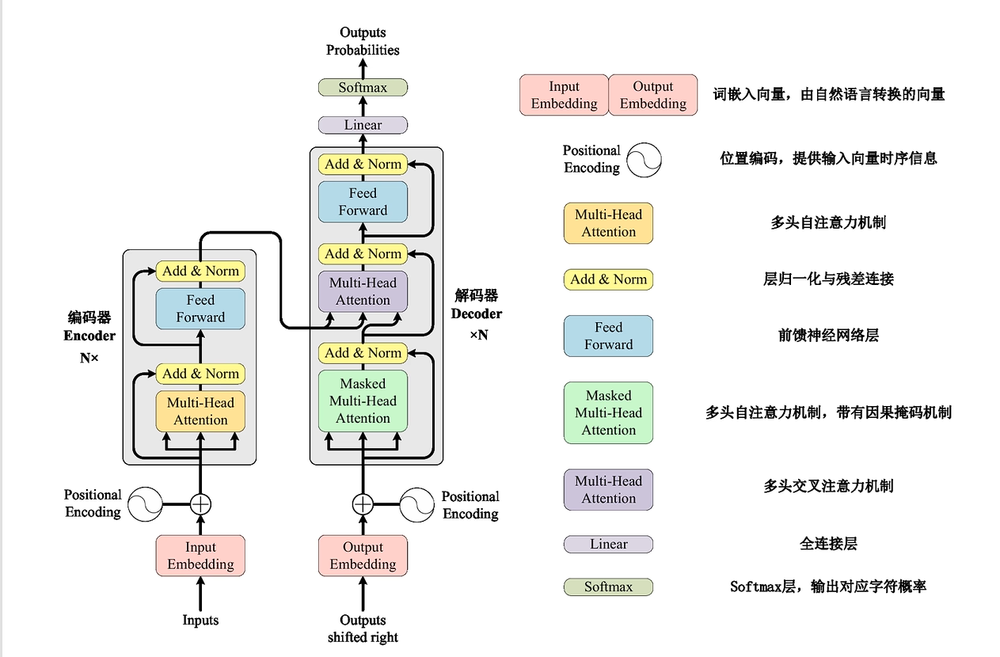
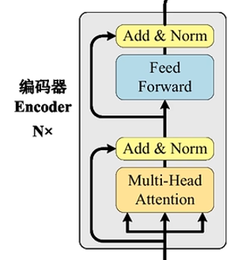
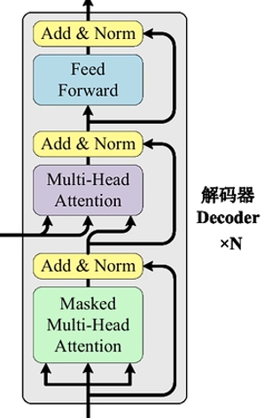

# Transformer全结构



## make\_model 函数详解

```python
def make_model(
    src_vocab,    # 源语言词汇表大小
    tgt_vocab,    # 目标语言词汇表大小
    N=6,          # Encoder 和 Decoder 的层数
    d_model=512,  # 模型隐藏维度
    d_ff=2048,    # 前馈网络的中间维度
    h=8,          # 注意力头数
    dropout=0.1   # Dropout 概率
):
    """
    构建完整的 Transformer 模型
    
    参数:
        src_vocab: 源语言词汇表大小
        tgt_vocab: 目标语言词汇表大小
        N: Encoder/Decoder 的层数（论文中是 6）
        d_model: 模型隐藏维度（论文中是 512）
        d_ff: 前馈网络中间层维度（论文中是 2048）
        h: 多头注意力头数（论文中是 8）
        dropout: Dropout 概率
    
    返回:
        完整的 EncoderDecoder 模型
    """
    
    # ============================================
    # 步骤 1: 准备基础组件
    # ============================================
    
    # 定义 deepcopy 的简写，后面会频繁用到
    c = copy.deepcopy
    
    # 创建多头注意力模块
    # 这个模块会被多次复制使用
    attn = MultiHeadedAttention(h, d_model)
    
    # 创建前馈网络模块
    ff = PositionwiseFeedForward(d_model, d_ff, dropout)
    
    # 创建位置编码模块
    position = PositionalEncoding(d_model, dropout)
    
    # ============================================
    # 步骤 2: 组装完整的 Transformer 模型
    # ============================================
    
    model = EncoderDecoder(
        # --- Encoder ---
        # Encoder 由 N 个 EncoderLayer 层组成
        Encoder(
            EncoderLayer(
                d_model,        # 模型维度
                c(attn),        # 自注意力（深拷贝！）
                c(ff),          # 前馈网络（深拷贝！）
                dropout         # Dropout
            ),
            N  # Encoder 层数
        ),
        
        # --- Decoder ---
        # Decoder 由 N 个 DecoderLayer 层组成
        Decoder(
            DecoderLayer(
                d_model,        # 模型维度
                c(attn),        # 掩码自注意力（深拷贝！）
                c(attn),        # 源-目标注意力（深拷贝！）
                c(ff),          # 前馈网络（深拷贝！）
                dropout         # Dropout
            ),
            N  # Decoder 层数
        ),
        
        # --- 源语言嵌入 ---
        # 词嵌入 + 位置编码
        nn.Sequential(
            Embeddings(d_model, src_vocab),  # 词嵌入
            c(position)                      # 位置编码（深拷贝！）
        ),
        
        # --- 目标语言嵌入 ---
        # 词嵌入 + 位置编码
        nn.Sequential(
            Embeddings(d_model, tgt_vocab),  # 词嵌入
            c(position)                      # 位置编码（深拷贝！）
        ),
        
        # --- Generator ---
        # 将最后输出映射回词汇表概率分布
        Generator(d_model, tgt_vocab)
    )
    
    # ============================================
    # 步骤 3: 初始化参数
    # ============================================
    
    # 对所有参数进行 Xavier 初始化（论文中的做法）
    for p in model.parameters():
        if p.dim() > 1:  # 只初始化矩阵参数，偏置不初始化
            nn.init.xavier_uniform_(p)
    
    # 返回完整模型
    return model
```

## 词嵌入层（Input/Output Embeddings）

将离散的单词（通常表示为整数 ID）转换为模型可以处理的连续且具有固定维度的稠密向量，并对向量进行特定的缩放。

```python
class Embeddings(nn.Module):
    """词嵌入层：将离散的 token ID 转换为连续的向量表示"""
    
    def __init__(self, d_model, vocab):
        """
        初始化词嵌入层
        
        参数:
            d_model: 模型的隐藏维度 (论文中为 512)
                     每个 token 会被映射为一个 d_model 维的向量
            vocab: 词汇表大小 (例如 37000)
        """
        super(Embeddings, self).__init__()
        self.lut = nn.Embedding(vocab, d_model)  # Look-Up Table 查找表
        self.d_model = d_model

    def forward(self, x):
        """
        前向传播
        
        参数:
            x: token ID 序列，形状为 (batch_size, sequence_length)
               例如: [[1, 7, 3, 9], [4, 2, 8, 5]]
        
        返回:
            嵌入向量，形状为 (batch_size, sequence_length, d_model)
            每个 token ID 被替换为对应的 d_model 维向量
        """
        # 1. 查表：将每个 token ID 替换为对应的嵌入向量
        # 2. 缩放：乘以 √(d_model) 进行数值缩放
        return self.lut(x) * math.sqrt(self.d_model)
```

## Transformer 位置编码 (Positional Encoding)

### 一、 核心数学公式

Transformer 论文中使用了不同频率的正弦和余弦函数来生成位置编码（PositionalEncoding 函数）：

$PE\_{(pos, 2i)} = \sin(pos / 10000^{2i / d\_{\text{model}}})$

$PE\_{(pos, 2i+1)} = \cos(pos / 10000^{2i / d\_{\text{model}}})$

- $pos$：当前词在句子中的绝对位置（例如第 0 个词，第 1 个词）。
- $i$：词向量的维度索引（从 $0$ 到 $d\_{\text{model}}/2$）。
- $d\_{\text{model}}$：词向量的总维度（代码中通常是 512）。

这个公式的精妙之处在于，对于任何固定的偏移量 $k$，$PE\_{pos+k}$ 都可以表示为 $PE\_{pos}$ 的线性函数，这有助于模型学习词与词之间的**相对位置关系**。

***

### 二、 代码逐行解析

这份代码位于你上传的文件的 `PositionalEncoding` 类中。为了兼顾计算效率，这段 PyTorch 代码并没有直接使用上述公式进行 `for` 循环，而是使用了一些矩阵运算的技巧。

#### 1. 初始化部分 (`__init__`)

```Python
class PositionalEncoding(nn.Module):
    def __init__(self, d_model, dropout, max_len=5000):
        super(PositionalEncoding, self).__init__()
        self.dropout = nn.Dropout(p=dropout)
```

- `d_model`: 模型的维度（如 512）。
- `dropout`: 丢弃率，用于防止过拟合。
- `max_len`: 预设的序列最大长度，默认 5000 足够绝大多数 NLP 任务使用。我们会在初始化时一次性计算好这 5000 个位置的编码，避免每次前向传播时重复计算。

#### 2. 核心张量运算 (对数空间优化)

```Python
        # Compute the positional encodings once in log space.
        pe = torch.zeros(max_len, d_model)
        position = torch.arange(0, max_len).unsqueeze(1)
```

- `pe`: 创建一个大小为 `(5000, 512)` 的全 0 矩阵，用来存放所有位置的编码。
- `position`: 创建一个从 0 到 4999 的一维张量，然后用 `unsqueeze(1)` 把它变成形状为 `(5000, 1)` 的列向量，代表绝对位置 $pos$。

```Python
        div_term = torch.exp(
            torch.arange(0, d_model, 2) * -(math.log(10000.0) / d_model)
        )
```

- **这是整段代码最难懂的地方：对数空间运算。**

  代码没有直接计算 $\frac{1}{10000^{2i / d\_{\text{model}}}}$，因为在计算机中直接计算大指数的分数容易出现数值不稳定或溢出。

  根据数学对数性质：

  $\frac{1}{10000^{2i/d}} = 10000^{-2i/d} = e^{\ln(10000^{-2i/d})} = e^{-\frac{2i}{d} \ln(10000)}$

  对应到代码里：
  - `torch.arange(0, d_model, 2)` 生成了数列 `[0, 2, 4, ...]`，这就对应了公式里的 $2i$。
  - `-(math.log(10000.0) / d_model)` 对应了 $-\frac{\ln(10000)}{d}$。
  - 外面套上 `torch.exp` 即可得到分母的除数因子 `div_term`。

```Python
        pe[:, 0::2] = torch.sin(position * div_term)
        pe[:, 1::2] = torch.cos(position * div_term)
```

- `0::2` 表示从索引 0 开始，步长为 2（即 0, 2, 4, 6... 的偶数列）。将这些列赋值为 $\sin$ 函数的值。
- `1::2` 表示从索引 1 开始，步长为 2（即 1, 3, 5, 7... 的奇数列）。将这些列赋值为 $\cos$ 函数的值。
- 这里利用了 PyTorch 的广播机制（Broadcasting），`position` 矩阵 `(5000, 1)` 乘以 `div_term` 矩阵 `(256,)`，会自动生成 `(5000, 256)` 的结果矩阵。

#### 3. 注册为 Buffer (`register_buffer`)

```Python
        pe = pe.unsqueeze(0)
        self.register_buffer("pe", pe)
```

- `unsqueeze(0)`：在最外层增加一个 Batch 维度，将形状变成 `(1, 5000, 512)`，以便后续与输入张量（Batch Size, Seq Length, d\_model）直接相加。
- `self.register_buffer`：这是 PyTorch 的一个重要特性。位置编码 `pe` 是固定的（不可训练的参数），但我们需要它和模型一起保存在 `state_dict` 中，且能够在调用 `.cuda()` 时自动移动到 GPU 上。使用 `register_buffer` 可以完美实现这一点。

#### 4. 前向传播 (`forward`)

```Python
    def forward(self, x):
        x = x + self.pe[:, : x.size(1)].requires_grad_(False)
        return self.dropout(x)
```

- `x`: 模型的输入，形状通常是 `(batch_size, sequence_length, d_model)`。
- `self.pe[:, : x.size(1)]`: 因为我们预先计算了 5000 个位置，这里根据当前输入的实际长度 `x.size(1)` 将多余的切片截断掉。
- `requires_grad_(False)`: 再次确保反向传播时不会对位置编码求梯度（节省显存和算力）。
- **最后一步：** 将词嵌入表示 `x` 与位置编码 `pe` **直接相加**（注意是相加，不是拼接），然后通过 Dropout 层返回。

## 自注意力机制（attention）

这段代码实现的是深度学习中非常著名的**缩放点积注意力机制（Scaled Dot-Product Attention）**，它是 Transformer 模型（也就是 ChatGPT 等大模型的核心基础）的灵魂（attention 函数）。

你觉得这段代码难以理解是非常正常的！特别是如果你不太熟悉 PyTorch 的张量（矩阵）操作，它看起来就像一堆晦涩的数学符号。

为了让你更容易理解，我们先抛开代码，用一个\*\*“图书馆找书”\*\*的通俗例子来解释这个过程，然后再逐行拆解代码。

### 📚 通俗比喻：在图书馆找书

想象你走进图书馆想要找资料：

1. **Query (Q - 查询)**：你的搜索意图，比如你在系统里输入了“人工智能”。
2. **Key (K - 键)**：图书馆里每本书的标签或书名，比如“机器学习”、“Python编程”、“西方历史”。
3. **Value (V - 值)**：每本书里的实际内容。

**注意力机制是怎么工作的？**

它会把你的搜索意图（Query）和所有书的标签（Key）进行对比，计算出一个“相似度得分”。得分越高的书，说明越符合你的需求。然后，它会根据这些得分，把所有书的内容（Value）按比例混合起来给你。也就是说，如果“机器学习”得分最高，你得到的最终结果里就会包含大量的“机器学习”内容，而几乎没有“西方历史”的内容。

***

### 🧮 核心数学公式

这段代码实际上只是把下面这个优雅的数学公式翻译成了 PyTorch 代码：

$$\text{Attention}(Q, K, V) = \text{softmax}\left(\frac{QK^T}{\sqrt{d\_k}}\right)V$$

***

### 💻 逐行代码拆解

现在我们逐行来看这段 PyTorch 代码在干什么：

```Python
def attention(query, key, value, mask=None, dropout=None):
```

这是定义函数。接收你输入的 `query` (Q)、`key` (K)、`value` (V)。`mask` 用于遮掩不想看到的信息，`dropout` 用于防止模型死记硬背（过拟合）。

```Python
    d_k = query.size(-1)
```

**获取维度：** 这一步是获取 Query 向量的长度（也就是词向量的维度）。`.size(-1)` 在 PyTorch 里表示获取张量（多维数组）最后一个维度的大小。我们提取出 $d\_k$ 是为了后面的“缩放”做准备。

```Python
    scores = torch.matmul(query, key.transpose(-2, -1)) / math.sqrt(d_k)
```

**计算相似度得分：** 这是最核心的一步！

- `torch.matmul(query, key.transpose(-2, -1))`：转置 Key 矩阵的最后两个维度，让 Q 和转置后的 K 进行矩阵乘法（计算点积）。点积越大，说明 Query 和 Key 越相关，注意力分数越高。
- `/ math.sqrt(d_k)`：这是**缩放（Scaled）**。除以维度 $d\_k$ 的平方根。如果不除以它，当维度很大的时候，点积的结果会非常大，导致后面的 softmax 函数失效（梯度消失），模型就学不到东西了。

```Python
    if mask is not None:
        scores = scores.masked_fill(mask == 0, -1e9)
```

**遮掩无用信息（Masking）：** 有时候我们不想让模型看到某些内容（比如在翻译时不能提前看到未来的词，或者句子长度不够用0填充的部分）。`mask == 0` 就是找到这些不需要看的地方，然后用 `.masked_fill` 把它们的得分替换成一个极小的数字（`-1e9`，即负十亿）。这样在下一步转换概率时，这些地方的概率就会变成 0。

```Python
    p_attn = scores.softmax(dim=-1)
```

**转化为权重比例：** 对最后一个维度的分数做 Softmax 归一化。`softmax` 是一个魔法函数，它会把刚才算出来的各种得分变成**加起来等于 1 的概率分布**（权重）。比如得分变成 `[0.8, 0.15, 0.05]`。得分越高的项，分配到的权重就越大。

```Python
    if dropout is not None:
        p_attn = dropout(p_attn)
```

**随机丢弃：** 随机丢弃一部分注意力权重。这是深度学习中防止过拟合的常用手段。训练时随机让一些神经元的连接失效，迫使模型学到更鲁棒的特征。

```Python
    return torch.matmul(p_attn, value), p_attn
```

**得出最终结果：**

- `torch.matmul(p_attn, value)`：把刚才算出的权重（概率）乘以实际的内容（Value）。这就是“加权求和”的过程。如果某个 Key 和 Query 很匹配，权重就大，那么对应的 Value 提取出来的信息就多；反之则少。
- 第一个是注意力层的输出结果（新的特征表示），第二个是 `p_attn`（注意力权重矩阵，通常用于可视化，看看模型到底把注意力集中在了哪些词上）。

## 多头注意力机制(Multi-Head Attention)

多头注意力机制就是为了让模型理解词与词之间的\*\*“多重复杂关系”\*\* （MultiHeadedAttention 函数）。

### 一、 为什么需要“多头”？

想象你在阅读句子 **"The animal didn't cross the street because it was too tired."** 当你试图理解 "it" 指代什么时：

- **注意力头 A** 可能关注语法结构（寻找最近的名词 "animal"）。
- **注意力头 B** 可能关注语义逻辑（谁会 "tired"？也是 "animal"）。
- **注意力头 C** 可能关注行为关联（谁在 "cross the street"？）。

如果只有一个注意力头，所有的信息融合在一起容易变得模糊。**多头机制允许模型将数据映射到不同的子空间中，并行地关注不同维度的特征。**

***

### 二、 核心数学公式

首先，标准缩放点积注意力（Scaled Dot-Product Attention）的公式是：

$$\mathrm{Attention}(Q, K, V) = \mathrm{softmax}(\frac{QK^T}{\sqrt{d\_k}})V$$

而多头注意力的做法是，将 $Q, K, V$ 分别通过不同的线性变换映射 $h$ 次（$h$ 为头的数量），并行计算上述注意力，最后将结果拼接（Concat）并再次线性映射：

$$\mathrm{MultiHead}(Q, K, V) = \mathrm{Concat}(\mathrm{head\_1}, ..., \mathrm{head\_h})W^O$$

其中

$$\mathrm{head\_i} = \mathrm{Attention}(QW^Q\_i, KW^K\_i, VW^V\_i)$$

***

### 三、 代码逐段深度解析

这份代码将原本复杂的“并行映射”转化为了极其优雅的**矩阵维度变换（Reshape / View）技巧**。这也是 PyTorch 工程实现中最精彩的部分之一。

#### 1. 初始化阶段 (`__init__`)

```Python
class MultiHeadedAttention(nn.Module):
    def __init__(self, h, d_model, dropout=0.1):
        super(MultiHeadedAttention, self).__init__()
        
        # 断言：d_model 必须能被 h 整除
        # 因为每个头的维度 = d_model / h
        assert d_model % h == 0
        
        self.d_k = d_model // h  # 每个头的维度，512/8=64
        self.h = h               # 注意力头数，8
        
        # 创建 4 个线性变换层：
        #   前 3 个用于 Q, K, V 的投影
        #   第 4 个用于最终输出的投影
        self.linears = clones(nn.Linear(d_model, d_model), 4)
        
        self.attn = None         # 保存注意力权重（用于可视化）
        self.dropout = nn.Dropout(p=dropout)
```

- **`assert d_model % h == 0`**: 模型的总维度（通常是 512）必须能被头数（通常是 8）整除。这样每个头分到的维度就是 $512 / 8 = 64$ 维（即 `self.d_k`）。
- **`self.linears = clones(nn.Linear(d_model, d_model), 4)`**: **（高能预警）** 按照理论公式，我们需要为 8 个头分别建立 $W^Q, W^K, W^V$ 的权重矩阵。但在工程上那样写非常慢！

  这里的聪明做法是：直接克隆 4 个尺寸为 `(d_model, d_model)` 的全连接层。前 3 个用来同时处理所有头的 $Q, K, V$ 的线性映射，第 4 个用来做最后的输出映射 $W^O$。

#### 2. 前向传播 (`forward`)

这是数据真正流动的过程。假设输入的形状是 `(batch_size, seq_len, d_model)`。

##### 步骤 1：线性映射与维度拆分

```Python
    def forward(self, query, key, value, mask=None):
        
        # 1️⃣ 扩展 mask 维度，以便广播到所有头
        if mask is not None:
            # 在第 1 维的地方，给我硬塞一个 1 进去。
            # mask 原来：(batch,  1,  seq_len)
            # mask 插入：(batch, [1], 1, seq_len)
            # mask 结果：(batch,  1,  1, seq_len)
            # 如果你执行 mask.unsqueeze(0)，形状就会变成 (1, batch, 1, seq_len)
            mask = mask.unsqueeze(1)
            # 形状: (batch, 1, 1, seq_len) → 可广播到 (batch, h, seq_len, seq_len)(为了触发 PyTorch 的广播机制)
            # 要把 Mask 和 多头注意力计算出的 Scores 张量(Scores 形状：(batch, head, seq_len, seq_len))相加
        
        nbatches = query.size(0)   # # 获取 batch_size
        
        # 2️⃣ 对 Q, K, V 做线性变换，然后拆分成多个头
        query, key, value = [
            lin(x)             # 线性变换: (batch, seq_len, d_model) → (batch, seq_len, d_model)
            .view(nbatches, -1, self.h, self.d_k)  # 拆分: (batch, seq_len, d_model) → (batch, seq_len, h, d_k)
            .transpose(1, 2)                    # 转置: → (batch, h, seq_len, d_k)
            for lin, x in zip(self.linears, (query, key, value))
        ]
```

这是全篇最难懂的一行代码，我们拆开来看：

1. `lin(x)` 中的 `x` 是哪里来的？

`x` 来自于这段代码末尾的 `for lin, x in zip(...)` 循环。

在 Python 中，`zip` 函数会将多个列表/元组打包在一起，然后**同时遍历**它们。我们来看看 `zip(self.linears, (query, key, value))` 做了什么：

- `self.linears` 是一个包含了 3 个线性层（神经网络层）的列表：`[Linear_1, Linear_2, Linear_3]`。
- `(query, key, value)` 是一个包含了 3 个张量（Tensor，可以理解为多维数组）的元组。

`zip` 会把它们按位置配对，每次循环取出一对：

- **第 1 次循环**：`lin` = Linear\_1，`x` = query
- **第 2 次循环**：`lin` = Linear\_2，`x` = key
- **第 3 次循环**：`lin` = Linear\_3，`x` = value

所以，**`x`** **只是一个循环变量，它依次代表了** **`query`、`key`** **和** **`value`** **这三个输入数据**。`lin(x)` 就是分别对这三个数据做线性变换。

***

1. 这段代码在干什么？（详细拆解）

这段代码的核心目的是：**对输入的 query、key、value 进行线性变换，并把它们“切分”成多个头，为后续计算多头注意力做准备。**

为了让你彻底明白，我们把这个列表推导式（List Comprehension）展开成普通的 `for` 循环，你会发现清晰很多：

```python
# 原代码是一行的列表推导式，等价于下面的展开写法：
results = []
for lin, x in zip(self.linears, (query, key, value)):
    # 第一步：lin(x) 
    # 第二步：.view(...)
    # 第三步：.transpose(...)
    temp = lin(x).view(nbatches, -1, self.h, self.d_k).transpose(1, 2)
    results.append(temp)

# 最后把结果分别赋值给新的 query, key, value
query, key, value = results
```

接下来，我们逐个击破这三步在干什么。假设我们输入了一句话，包含 10 个单词，每个单词用 512 维的向量表示，批次大小为 32（即同时处理 32 句话）。此时：

- `query`, `key`, `value` 的初始形状都是：`[32, 10, 512]` (即 \[批次大小, 句子长度, 特征维度])

第一步：`lin(x)` —— 线性变换

在 PyTorch 中，`Linear` 层本质上是一个矩阵乘法 $y = Wx + b$。这里的作用是把 512 维的向量映射成另一个 512 维的向量（不改变维度，但学习了数据的新表示）。

- **输入** **`x`** **的形状**：`[32, 10, 512]`
- **输出** **`lin(x)`** **的形状**：`[32, 10, 512]`（尺寸没变，但数值经过了线性变换）

1. 直觉上，`lin(x)` 在干什么？

你可以把 `lin(x)` 想象成一个\*\*“加工厂”**或者一个**“翻译官”\*\*：

- **`x`** 是输入的原材料（比如一句话的数学表示）。
- **`lin`** 是加工厂的机器/翻译官的规则。
- **`lin(x)`** 就是把原材料送进机器，输出加工后的产品。

在神经网络中，这个加工过程通常叫做**线性变换**或**线性投影**。

***

1. 数学上，`lin(x)` 在干什么？

在 PyTorch 中，`lin` 通常是一个 `nn.Linear` 对象（全连接层）。它的核心数学公式非常简单：$$y = xW^T + b$$

- **$x$**：你的输入矩阵。
- **$W$**：权重矩阵，这是这个加工厂的核心！它是模型通过海量数据**自己学习**出来的参数（也就是神经网络的“脑细胞”）。
- **$b$**：偏置向量，也是模型学出来的参数，相当于给输出加个微调。
- **$y$**：输出结果，也就是 `lin(x)` 的返回值。

**维度变化（重点）**：
假设我们在定义模型时写了 `nn.Linear(512, 512)`，这意味着：

- 输入 $x$ 的最后一个维度是 512。
- 权重 $W$ 的形状是 `[512, 512]`。
- 输出 $y$ 的最后一个维度也是 512。

结合我们上一轮的例子，输入 `x` 的形状是 `[32, 10, 512]`（32句话，10个词，每个词512维向量）。经过 `lin(x)` 后，**形状依然是** **`[32, 10, 512]`**。

***

1. 灵魂拷问：既然输入是 512 维，输出还是 512 维，尺寸都没变，那我还要 `lin(x)` 干嘛？为什么不直接用 `x`？

这是一个非常棒的问题！这也是理解 Transformer 的关键所在。`lin(x)` 的目的根本不是为了改变数据的尺寸，而是为了**改变数据的内容（特征表示）**，这被称为\*\*“投影”\*\*。

想象一下：

- 你有一篇中文文章（`x`）。
- 你让一个翻译官把它翻译成英文（`lin_1(x)` -> query）。
- 你让另一个翻译官把它翻译成法文（`lin_2(x)` -> key）。
- 你让第三个翻译官把它翻译成日文（`lin_3(x)` -> value）。

虽然中、英、法、日文章包含的**核心信息是一样的**，但它们被转换到了**不同的语言空间**，这样你就可以在不同语言之间寻找规律（比如对比英文和法文的语法相似性）。

在多头注意力机制中：

- 原始的 `x`（query, key, value 最初可能是一样的）就像是一张普通的照片。
- `lin_query(x)` 相当于给照片加了一个\*\*“寻找边缘”\*\*的滤镜，提取出“我要找什么”的特征。
- `lin_key(x)` 相当于给照片加了一个\*\*“寻找颜色”\*\*的滤镜，提取出“我有什么特征”的信号。
- `lin_value(x)` 相当于给照片加了一个\*\*“提取纹理”\*\*的滤镜，提取出“实际的内容信息”。

**注意：** 代码中的 `zip(self.linears, (query, key, value))` 意味着这里有 **3 个不同的** **`lin`**（3 台不同的机器，拥有完全不同的权重 $W$）。所以：

- `lin1(query)` 生成了真正的 Query。
- `lin2(key)` 生成了真正的 Key。
- `lin3(value)` 生成了真正的 Value。

它们各自带着不同的任务，把原本相同的输入投射到了三个不同的表示空间中，为后续计算“谁和谁更相关（注意力分数）”做好了准备。

***

1. PyTorch 的黑魔法：为什么写 `lin(x)` 就能算 $y = xW^T + b$？

在 PyTorch 中，一切神经网络模块都是 `nn.Module` 的子类。`nn.Linear` 也是。当你写 `lin = nn.Linear(512, 512)` 时，PyTorch 在后台偷偷帮你做了两件事：

1. 创建了一个形状为 `[512, 512]` 的权重矩阵 $W$，并随机初始化。
2. 创建了一个形状为 `[512]` 的偏置向量 $b$，并随机初始化。

`nn.Linear` 类内部实现了一个特殊的 `__call__` 方法（Python 的魔法方法）。当你写 `lin(x)` 时，Python 实际上调用的是 `lin.forward(x)`，而 `forward` 函数的底层就是那句矩阵乘法：`torch.matmul(x, W.T) + b`。

所以，`lin(x)` 只是 PyTorch 提供的一种优雅、面向对象的写法，让你不用每次都手写复杂的矩阵乘法公式，直接把数据“喂”给层，它就会自动帮你计算并返回结果。

***

第二步：`.view(nbatches, -1, self.h, self.d_k)` —— 切分多头

这是 PyTorch 中改变张量形状的操作，类似 NumPy 的 `reshape`。在多头注意力中，我们不想用一整个 512 维的空间去算注意力，而是想把它切分成 8 个头（`self.h = 8`），每个头用 64 维（`self.d_k = 64`）去算。$8 \times 64 = 512$。

- `nbatches`：批次大小，保持不变（32）。
- `-1`：这个维度让 PyTorch 自己算，这里代表句子长度（10）。
- `self.h`：头的数量（8）。
- `self.d_k`：每个头的维度（64）。
- **变换前的形状**：`[32, 10, 512]`
- **变换后的形状**：`[32, 10, 8, 64]`
  这一步相当于把原来每个单词的 512 维向量，拆成了 8 份 64 维的小向量。

***

第三步：`.transpose(1, 2)` —— 维度转置

`.transpose(1, 2)` 的意思是把第 1 个维度（句子长度 10）和第 2 个维度（头数 8）交换位置。

为什么要交换？因为后续计算注意力时，我们是**按头**来计算的。我们需要让“头”这个维度靠前，这样每个头就能独立、并行地处理属于自己那个 64 维的小向量。

- **转置前的形状**：`[32, 10, 8, 64]` (批次, 句长, 头数, 头维)
- **转置后的形状**：`[32, 8, 10, 64]` (批次, 头数, 句长, 头维)

##### 步骤 2：并行计算注意力

```Python
        # 2) Apply attention on all the projected vectors in batch.
        x, self.attn = attention(
            query, key, value, mask=mask, dropout=self.dropout
        )
```

将形状为 `(batch_size, 8, seq_len, 64)` 的 $Q, K, V$ 送入基础的 `attention` 函数。内部通过 `torch.matmul` 会对最后两个维度进行矩阵乘法。得到的结果 `x` 形状依然是 `(batch_size, 8, seq_len, 64)`。

##### 步骤 3：拼接头并输出

```Python
        # 3) "Concat" using a view and apply a final linear.
        x = (
            x.transpose(1, 2)
            .contiguous()
            .view(nbatches, -1, self.h * self.d_k)
        )
        # ... (del 释放显存操作)
        return self.linears[-1](x)
```

1. `x.transpose(1, 2)`: 先把维度换回来，变成 `(batch_size, seq_len, 8, 64)`。
2. `.contiguous()`: 内存连续化处理（PyTorch中转置后改变形状前的常规操作）。
3. `.view(nbatches, -1, self.h * self.d_k)`: 把最后两个维度重新合并成 `8 * 64 = 512`。这一步**等价于公式中的 Concat（拼接）操作**，形状变回 `(batch_size, seq_len, 512)`。
4. 最后，通过第 4 个线性层 `self.linears[-1](x)` 做最后一次信息融合输出。

## 位置前馈网络(Feed Forward)

在 Transformer 的编码器（Encoder）和解码器（Decoder）中，每一层都包含两个主要的子层：一个是多头注意力机制（Multi-Head Attention），另一个就是这个**前馈神经网络（Feed-Forward Network, 简称 FFN）**。

让我们结合你提供的代码，逐行拆解这个类的作用和原理（PositionwiseFeedForward 函数）：

### 1. 核心数学原理

这个前馈网络本质上是一个包含两个线性变换（Linear）和一个 ReLU 激活函数的两层全连接神经网络。它的数学公式可以表示为：

$$\text{FFN}(x) = \max(0, xW\_1 + b\_1)W\_2 + b\_2$$

- $W\_1$ 和 $b\_1$ 是第一层线性变换的权重和偏置。
- $\max(0, \cdot)$ 代表 ReLU 激活函数。
- $W\_2$ 和 $b\_2$ 是第二层线性变换的权重和偏置。

### 2. 代码详细拆解

```Python
class PositionwiseFeedForward(nn.Module):
    def __init__(self, d_model, d_ff, dropout=0.1):
        super(PositionwiseFeedForward, self).__init__()
        # 第一层线性变换：将维度从 d_model 映射到更大的 d_ff
        self.w_1 = nn.Linear(d_model, d_ff)
        # 第二层线性变换：将维度从 d_ff 映射回原始的 d_model
        self.w_2 = nn.Linear(d_ff, d_model)
        # Dropout 层，用于防止过拟合
        self.dropout = nn.Dropout(dropout)
```

**初始化参数 (`__init__`)：**

- `d_model`：模型的基础维度（在标准 Transformer 中通常是 512）。这是输入和最终输出的特征维度。
- `d_ff`：前馈网络中间隐藏层的维度（通常比 `d_model` 大得多，标准论文中是 2048）。这形成了一个“升维再降维”的结构，允许模型在更高维度的空间中提取非线性特征。
- `dropout`：失活率，默认 0.1。

```Python
    def forward(self, x):
        # 1. x 输入到第一层线性网络 self.w_1(x)
        # 2. 经过 .relu() 激活函数引入非线性
        # 3. 经过 dropout 层进行正则化
        # 4. 最后通过第二层线性网络 self.w_2 输出
        return self.w_2(self.dropout(self.w_1(x).relu()))
```

**前向传播 (`forward`) 流程：**

这里完美对应了上面提到的数学公式。数据依次流经：**线性层 1 $\rightarrow$ ReLU 激活 $\rightarrow$ Dropout $\rightarrow$ 线性层 2**。

### 3. 为什么叫 "Position-wise"（逐位置）？

这是理解这个网络最关键的一点。在 Transformer 中，输入数据 `x` 的形状通常是 `(batch_size, sequence_length, d_model)`（比如：批次大小，句子长度，词向量维度）。

- \*\*注意力机制（Attention）\*\*的作用是让句子中的不同单词（不同位置）**互相交流**，混合信息。
- **Position-wise FFN** 的作用则是对句子中的**每一个单词（每一个位置）独立地应用完全相同的这两层神经网络**。在 FFN 这一步，位置 1 的单词和位置 2 的单词之间**没有任何信息交互**。

你可以把它想象成：注意力层负责梳理词与词之间的关系（全局上下文），而前馈层负责将梳理好的每个词的信息进一步加工和提炼（局部特征增强）。

## 残差连接与层归一化(Add & Norm)

**Add & Norm**（残差连接与层归一化）是 Transformer 模型中极其重要的“基础设施”。如果没有它，Transformer 根本无法堆叠到几十甚至上百层（也就是无法训练出今天的大型语言模型）。

顾名思义，它由两部分组成：**Add（残差连接）** 和 **Norm（层归一化）**。让我们掰开揉碎来详细看看。(SublayerConnection 函数)

### 1. Add：残差连接 (Residual Connection)

**核心公式：**$$Output = x + \text{Sublayer}(x)$$

*(其中 $x$ 是输入，$\text{Sublayer}$ 指的是多头注意力层或前馈神经网络层)*

**它的原理是什么？**

在传统的神经网络中，数据经过一层处理后，原来的输入 $x$ 就被“抛弃”了，输出的是经过非线性变换后的全新特征。

但在残差连接中，我们把**处理前的原始输入 $x$** 和**处理后的结果 $\text{Sublayer}(x)$** 加在一起，作为最终的输出。

**为什么必须要有 Add？**

- **解决梯度消失问题：** 在训练非常深的神经网络时，误差（梯度）在反向传播时需要经过无数次的乘法，很容易趋近于 0（梯度消失），导致靠近输入层的参数无法更新。
- **提供“信息高速公路”：** 加法操作（$+$）在求导时，梯度是直接原样传导的（即乘以 1）。这意味着梯度可以无损地直接跳过某些层，传回很浅的网络。这让几十层甚至上百层的网络变得非常容易训练。

***

### 2. Norm：层归一化 (Layer Normalization)

**核心公式：**$$\text{LayerNorm}(x) = \gamma \frac{x - \mu}{\sigma + \epsilon} + \beta$$

*(其中 $\mu$ 是均值，$\sigma$ 是方差，$\gamma$ 和 $\beta$ 是模型可学习的缩放和平移参数，$\epsilon$ 是防止分母为 0 的极小值)*

**它的原理是什么？**

假设一个词汇的向量维度是 512（`d_model = 512`）。层归一化会强行把这 512 个数字的**均值变成 0，方差变成 1**。然后再乘上一个可学习的参数 $\gamma$，加上一个可学习的偏置 $\beta$（让模型自己决定需不需要恢复一部分原来的分布特征）。

我把代码拆分成\*\*“初始化”**和**“前向计算”\*\*两部分来逐行解释：

#### 1. 初始化部分 (`__init__`)：准备可学习的参数

```Python
def __init__(self, features, eps=1e-6):
    super(LayerNorm, self).__init__()
    # self.a_2 对应公式里的缩放参数 γ (Gamma)
    self.a_2 = nn.Parameter(torch.ones(features))
    # self.b_2 对应公式里的平移参数 β (Beta)
    self.b_2 = nn.Parameter(torch.zeros(features))
    # 防止除以 0 的极小值 ε (Epsilon)
    self.eps = eps
```

- **`features`**: 输入的特征维度（也就是 Transformer 里的 `d_model`，比如 512）。
- **`nn.Parameter(...)`**: 这是 PyTorch 中非常关键的一步！普通的 Tensor 是不会被优化器更新的。套上 `nn.Parameter` 后，PyTorch 就会知道：“哦，**这两个变量是模型的参数，我需要在反向传播时计算它们的梯度并更新它们。**”
- **为什么** **`a_2`** **初始化为全 1，`b_2`** **初始化为全 0？**

  这保证了在模型刚开始训练的第一步，$\gamma$ 是 1，$\beta$ 是 0。此时模型仅仅是在做纯粹的标准化（把均值变 0，方差变 1），不对数据做额外的缩放和平移。随着训练的进行，模型会自己学会到底需不需要偏离标准正态分布。

***

#### 2. 前向计算部分 (`forward`)：核心逻辑

在 NLP 中，输入 `x` 的形状通常是 3 维的：`[batch_size, sequence_length, features]`（比如 `[2, 3, 512]`）。

```Python
def forward(self, x):
    # 1. 计算均值 μ (mu)
    mean = x.mean(-1, keepdim=True)
    # 2. 计算标准差 σ (sigma)
    std = x.std(-1, keepdim=True)
    # 3. 执行归一化并进行缩放和平移
    return self.a_2 * (x - mean) / (std + self.eps) + self.b_2
```

这里的几个参数设置极为精妙，完美体现了 Layer Norm 的特性：

- **为什么用** **`dim=-1`？**

  `-1` 在 Python 中代表**最后一个维度**。在 `[batch, seq, features]` 中，最后一个维度就是 `features`（也就是词向量的 512 维）。

  这完美呼应了我们上一轮说的：**Layer Norm 只对“某一个词自己”进行归一化。** 它顺着这 512 个数字求一个均值和方差，完全不管其他的词，也不管其他的句子。
- **为什么必须要有** **`keepdim=True`？**

  如果你的输入 `x` 是 `[2, 3, 512]`。

  如果不加 `keepdim`，求均值后结果形状会缩水成 `[2, 3]`。

  加了 `keepdim=True`，结果形状会保持为 `[2, 3, 1]`。

  **这非常重要！** 因为下一步你要用 `x - mean`。在 PyTorch（以及 Numpy）的广播机制（Broadcasting）中，只有当两者的维度数一样，且对应维度可以扩展时，才能相减。`[2, 3, 512]` 减去 `[2, 3, 1]` 是合法的（系统会自动把那个 `1` 复制 512 份去对齐相减）。
- **`std + self.eps`**：分母加上极小值 `eps`，纯粹是为了防止方差刚好为 0 时出现除以零导致程序崩溃（NaN）。

**为什么要用 Layer Norm，而不是 CV 里常用的 Batch Norm？**

- 在自然语言处理（NLP）中，每个句子的长度通常是不同的。如果我们像图像处理那样使用批归一化（Batch Normalization，跨越整个 Batch 去求某个特征维度的均值），效果会非常差，因为很多位置为了对齐被填充了无效的 Padding（例如 0）。
- **Layer Norm 是针对“每一个词”独立进行的**。它不去管别人，只在当前这个词的 512 维特征内部进行归一化。这使得训练过程更加平稳，对句子长度不敏感。

***

### 3. Add 与 Norm 的组合方式（关键知识点）

细心的你可能会发现，在你提供的哈佛大学代码中，Add 和 Norm 的执行顺序与原始论文（包括你上传的那张图）有一点点出入。这就是学术界常说的 **Post-Norm** 与 **Pre-Norm** 之争：

#### A. 原始论文 (Post-Norm)

这是你那张图里画的顺序：**先计算网络 -> 然后 Add -> 最后 Norm**

$$Output = LayerNorm(x + \text{Sublayer}(x))$$

- **特点：** 理论上效果好，但在层数很深时，训练早期非常不稳定，需要非常谨慎地设计“学习率预热”（Warm-up）机制。

#### B. 你提供的代码及现代主流实现 (Pre-Norm)

看你之前 SublayerConnection 代码里的这行：`x + self.dropout(sublayer(self.norm(x)))`。它的顺序是：**先 Norm -> 然后计算网络 -> 最后 Add**

$$Output = x + \text{Sublayer}(LayerNorm(x))$$

- **特点：** 原始输入 $x$ 有一条完全没有任何阻碍（连 Norm 都没有）的直达通道。**这使得即使网络非常深，在初始化阶段也能非常稳定地训练。**
- **现状：** 包括 GPT 系列、LLaMA 系列在内的绝大多数现代大语言模型，采用的都是这种 **Pre-Norm** 架构。

## 编码器层堆叠(EncoderLayer)



这是 Transformer 编码器的核心构建单元，理解它对于掌握整个 Transformer 架构至关重要。这段代码中的 `EncoderLayer` 类定义了 Transformer 模型中**编码器（Encoder）的一个单层结构**。在 Transformer 模型中，编码器通常由多个（比如 $N=6$ 个）这样完全相同的层堆叠而成。

为了真正理解它在执行什么，我们需要结合代码中它所依赖的 `SublayerConnection`（子层连接）一起来看。以下是 `EncoderLayer` 执行过程的详细拆解：

### 1. 结构初始化 (`__init__`)

当你创建一个 `EncoderLayer` 实例时，它接收并保存了构建这一层所需的核心组件：

- `self_attn`: 多头自注意力机制模块 (Multi-Head Attention)。
- `feed_forward`: 前馈神经网络模块 (Positionwise FeedForward)。
- `sublayer`: 使用 `clones` 函数克隆了 **两个** `SublayerConnection`。这两个子层连接就像是“包装盒”，分别用来包装自注意力机制和前馈神经网络。

### 2. 前向传播执行流程 (`forward`)

`forward(self, x, mask)` 方法定义了数据 `x`（输入序列的张量）流经这一层时的具体执行步骤。它严格按照 Transformer 架构执行了两大步骤：

#### 第一步：多头自注意力子层 (Multi-Head Attention Sublayer)

```Python
x = self.sublayer[0](x, lambda x: self.self_attn(x, x, x, mask))
```

这行代码将输入 `x` 传入第一个包装盒 `sublayer[0]`，并传入一个匿名函数 `lambda x: self.self_attn(x, x, x, mask)`。

`lambda` 是 Python 中定义**匿名函数**（没有名字的简短函数）的关键字。在这行代码中：`lambda x: self.self_attn(x, x, x, mask)`

- 它定义了一个接收一个参数（冒号前面的 `x`）的函数。
- 这个函数执行的操作是：把传入的这个 `x`，同时作为 Query、Key、Value 送给 `self.self_attn`，并带上 `mask`。

**为什么要用 `lambda`？为了“延迟执行” (Lazy Evaluation)。**

如果你不写 `lambda`，而是直接写成： `self.sublayer[0](x, self.self_attn(x, x, x, mask))` 那么 Python 会**先**执行 `self.self_attn(...)` 计算出注意力结果，然后把这个“结果”传给 `sublayer[0]`。但这**大错特错**！

因为 `SublayerConnection` 的设计要求传入的是一个**函数**（callable），它会在内部先对输入做 LayerNorm，再把归一化后的结果传给这个函数。你不能提前调用 `self.self_attn(...)`，因为那时候输入还没有经过 LayerNorm。

使用 `lambda` 后，你传递给 `self.sublayer[0]` 的不再是计算结果，而是一个**计算规则（或者说图纸）**。你等于在告诉 `sublayer[0]`：“我给你输入数据，再给你一个怎么调用注意力的规则。你先去把数据做好归一化，准备好了之后，再按这个规则去计算注意力。”

在这个过程中，具体执行了以下动作（由 `SublayerConnection` 的逻辑决定）：

1. **层归一化 (Layer Normalization)**：首先对输入 `x` 执行 `self.norm(x)`。*（注意：这种先进行归一化的方式被称为 Pre-LN，在训练深层网络时比原论文的 Post-LN 更稳定）*
2. **计算自注意力 (Self-Attention)**：归一化后的结果被传入 lambda 函数。在这里，它作为 Query、Key 和 Value（即传入了三个 `x`）参与多头自注意力的计算，并应用了注意力掩码 `mask`（用于忽略 padding 字符）。
3. **Dropout**：将自注意力层的输出进行随机失活操作，防止过拟合。
4. **残差连接 (Residual Connection)**：将原始输入 `x` 与 Dropout 后的结果相加（即 `x + ...`）。

此时，`x` 已经更新为了融合了序列中其他位置上下文信息的新张量。

#### 第二步：前馈神经网络子层 (Positionwise FeedForward Sublayer)

```Python
return self.sublayer[1](x, self.feed_forward)
```

这行代码将更新后的 `x` 传入第二个包装盒 `sublayer[1]`，这次包装的是前馈神经网络 `self.feed_forward`。

具体执行的动作与第一步类似：

1. **层归一化 (Layer Normalization)**：再次对进入这一步的 `x` 进行归一化。
2. **前馈网络 (Feed-Forward)**：将归一化后的数据送入两层全连接网络（中间夹着 ReLU 激活函数，在你的 `PositionwiseFeedForward` 代码中定义）。这个网络对序列中的每个位置独立且等同地进行非线性变换。
3. **Dropout**：对前馈网络的输出进行随机失活。
4. **残差连接 (Residual Connection)**：将进入第二步的原始 `x` 与前馈网络处理后的结果相加。

## 解码器层 (DecoderLayer)

为了更好地理解这段代码，你可以结合 Transformer 的架构图来看：



在 Transformer 中，解码器由多个完全相同的 `DecoderLayer` 堆叠而成（论文中是 6 层）。每个 `DecoderLayer` 内部包含 **三个子层 (Sublayers)**。

下面我为你逐行详细拆解这段代码：

### 1. 初始化方法 `__init__`

这里定义了解码器层所需的各个组件。

```Python
def __init__(self, size, self_attn, src_attn, feed_forward, dropout):
    super(DecoderLayer, self).__init__()
    self.size = size                  # 模型的维度 (d_model，论文中通常是 512)
    self.self_attn = self_attn        # 第一个子层：掩码多头自注意力机制 (Masked Multi-Head Self-Attention)
    self.src_attn = src_attn          # 第二个子层：交叉注意力机制 (Cross-Attention / Encoder-Decoder Attention)
    self.feed_forward = feed_forward  # 第三个子层：前馈神经网络 (Feed Forward Network)
    self.sublayer = clones(SublayerConnection(size, dropout), 3) # 克隆 3 个残差连接+层归一化模块
```

**关键点解析：**

- **三个核心机制：** `self_attn`、`src_attn` 和 `feed_forward` 分别对应解码器中的三个主要处理步骤。
- **`SublayerConnection`：** 在 Transformer 中，每个子层（注意力层或前馈层）的外部都有一个**残差连接 (Residual Connection)**，随后紧跟一个**层归一化 (Layer Normalization)**。`SublayerConnection` 就是封装了这个逻辑的模块。因为这里有 3 个子层，所以使用 `clones` 函数复制了 3 份（这里的 `clones` 是该教程中自定义的一个深拷贝工具函数）。

------

### 2. 前向传播方法 `forward`

这里定义了数据如何流经这三个子层。了解这一部分的关键在于弄清楚 **Q (Query)、K (Key)、V (Value)** 的来源。

```Python
def forward(self, x, memory, src_mask, tgt_mask):
    m = memory # memory 是编码器 (Encoder) 最后一层的输出
```

- **`x`**: 当前解码器层的输入（在第一层时，它是加上了位置编码的目标序列词向量）。
- **`memory`**: 编码器 (Encoder) 的最终输出，它包含了源语言句子的全部上下文信息。
- **`src_mask`**: 源序列掩码（用于屏蔽 `memory` 中的 `<pad>` 填充字符，防止注意力计算在无意义的空白上）。
- **`tgt_mask`**: 目标序列掩码（这是一个**下三角矩阵**，用于实现“掩码自注意力”，防止解码器在预测当前词时“偷看”到未来的词）。

#### 子层 1：掩码多头自注意力 (Masked Self-Attention)

```Python
``x = self.sublayer[0](x, lambda x: self.self_attn(x, x, x, tgt_mask))
```

- 这一步处理目标序列自身的内部关系。
- **Q, K, V 的来源：** 这里的输入是 `(x, x, x)`，意味着 Query, Key, Value **全部来自解码器当前的输入 `x`**。
- **Mask 的作用：** 传入了 `tgt_mask`。这非常关键！在生成序列时，当前位置只能看到它自己和它之前的词，不能看到后面的词。
- **Lambda 函数：** `sublayer[0]` 期望接收输入 `x` 和一个只接受单参数的处理函数。使用 `lambda x: ...` 是为了将多参数的 `self_attn` 包装成单参数函数传给 `sublayer` 统一处理残差和归一化。

#### 子层 2：交叉注意力 (Cross-Attention)

```Python
x = self.sublayer[1](x, lambda x: self.src_attn(x, m, m, src_mask))
```

- 这一步是解码器和编码器之间进行信息交互的地方，解码器在这里寻找源句子中对当前翻译最有用的信息。
- **Q, K, V 的来源：** 注意看参数是 `(x, m, m)`。
  - **Query (`x`)**：来自**上一个子层（自注意力层）的输出**。它代表解码器当前已经生成的内容状态。
  - **Key (`m`) 和 Value (`m`)**：来自**编码器的输出 `memory`**。它代表了原始输入句子的信息。
- **通俗理解：** 解码器拿着自己当前的诉求（Query），去编码器提供的知识库（Key）中进行匹配，匹配上之后提取出需要的信息（Value）。

#### 子层 3：前馈神经网络 (Feed Forward)

```Python
return self.sublayer[2](x, self.feed_forward)
```

- 最后一步，将交叉注意力的输出传入一个两层的全连接网络（中间带有 ReLU 激活函数），进行非线性变换。
- 完成后，返回最终的 `x`。这个 `x` 将会作为下一层 `DecoderLayer` 的输入，或者如果这是最后一层，就会送入一个线性映射和 Softmax 层去预测下一个词的概率。

## Testing greedy decode

在 Transformer 中，文本的生成过程叫做**自回归（Autoregressive）**，也就是像人说话一样，一个词一个词地往外蹦，并且下一个词的生成依赖于前面已经说过的词。这段代码就是在测试这个“蹦词”的循环逻辑对不对。我们把这段测试代码拆分成 **“解码器函数内部逻辑”** 和 **“外部执行测试”** 两个部分来详细看：

### 一、 核心函数：`greedy_decode` 的自回归循环

这个函数模拟了模型在实际应用中（比如机器翻译）是如何根据源句子生成目标句子的。

**1. 编码源句子（只做一次）**

```Python
memory = model.encode(src, src_mask)
```

- 模型首先把源语言句子 `src` 丢进 Encoder，提取出全部的上下文信息，保存在 `memory` 中。**注意：在整个解码过程中，Encoder 只运行这唯一的一次**，接下来 `memory` 会像字典一样被 Decoder 反复查阅。

**2. 初始化起始符**

```Python
ys = torch.zeros(1, 1).fill_(start_symbol).type_as(src.data)
```

这行代码在 Transformer 的解码过程（自回归生成）中起到了**“发令枪”**或**“种子”**的作用。简单来说，它的总目标是：**创建一个初始的张量（Tensor），里面只包含一个起始符号（Start Symbol），作为 Decoder 开始预测第一个词的输入。**

我们按照 PyTorch 的链式调用（Method Chaining）顺序，把它拆解成三个动作来详细看：

1. `torch.zeros(1, 1)`：开辟空间

- **动作**：创建一个形状（Shape）为 `[1, 1]` 的二维张量，里面用 `0` 填充。
- **物理意义**：
  - 第一个 `1` 代表 **Batch Size（批次大小）**。我们在测试时一次只翻译/生成一句话，所以是 1。
  - 第二个 `1` 代表 **Sequence Length（序列长度）**。因为现在刚要开始生成，序列里只有一个词。
- **潜在问题**：此时默认生成的张量数据类型通常是浮点型（Float），比如 `[[0.]]`。

2. `.fill_(start_symbol)`：填入起始符

- **动作**：把刚刚生成的张量里的所有元素（其实也就是那个唯一的 `0`），替换成 `start_symbol` 的值。
- **物理意义**：在 NLP 任务中，我们通常会规定一个特殊的标记（Token），比如 `<BOS>` (Begin Of Sentence) 或 `<SOS>` (Start Of Sequence)。在之前的测试代码中，传入的 `start_symbol=1`。
- **语法细节**：注意 `fill_` 后面跟着一个**下划线 `_`**。在 PyTorch 中，带有下划线的方法代表**“就地修改”（In-place Operation）**。它不会创建一个新的张量，而是直接修改原内存地址上的数据，这可以节省内存。
- **当前结果**：此时张量变成了 `[[1.]]`。

3. `.type_as(src.data)`：同步数据类型和设备

- **动作**：把当前张量的数据类型（Data Type）和所在的设备（Device，比如 CPU 或 GPU），转换得跟输入张量 `src.data` 一模一样。
- **物理意义（非常关键！）**：
  - **统一类型**：自然语言里的词汇 ID 必须是**整数**（通常是 64位整数 `torch.LongTensor`）。如果带着刚刚的浮点数 `[[1.]]` 进到 Embedding 层（词嵌入层）去查表，PyTorch 会直接报错崩溃，因为词典里没有第 “1.0” 个词。`src` 在定义时是 `LongTensor`，所以这个操作把 `ys` 也变成了整数型。
  - **统一设备**：如果你的 `src` 数据被放到了 GPU 上，而你新生成的 `ys` 默认是在 CPU 上，两者在后面做计算时也会报错（PyTorch 不允许跨设备直接计算）。`.type_as` 顺手把这个问题也解决了

**3. 循环生成接下来的词（核心）**

```Python
for i in range(max_len - 1):
    # 3.1 跑一次 Decoder
    out = model.decode(memory, src_mask, ys, subsequent_mask(ys.size(1)).type_as(src.data))
    
    # 3.2 取出最后一个位置的输出结果
    prob = model.generator(out[:, -1])
    
    # 3.3 贪心选择概率最大的词
    _, next_word = torch.max(prob, dim=1)
    next_word = next_word.data[0]
    
    # 3.4 拼接到已经生成的序列上
    ys = torch.cat([ys, torch.zeros(1, 1).type_as(src.data).fill_(next_word)], dim=1)
```

- **第 3.1 步**：把之前 Encoder 提取的 `memory`，以及**当前已经生成的序列 `ys`**，一起喂给 Decoder。注意这里加上了 `subsequent_mask`（下三角掩码），防止模型偷看。
- **第 3.2 步 (`out[:, -1]`)**：这是个很关键的细节！Decoder 会输出一个序列，但我们为了预测*下一个*词，只需要看 Decoder 对**当前生成的最后一个词**的理解。所以取出切片 `[:, -1]`，传给最后的线性分类层 `generator`，计算出词表里每个词的概率。
- **第 3.3 步**：所谓**贪心解码（Greedy Decode）**，就是不去考虑长远，只看眼前。哪个词当前的概率最大（`torch.max`），就选哪个词作为 `next_word`。
- **第 3.4 步**：把新预测出来的 `next_word` 像贪吃蛇一样拼接到 `ys` 的末尾。此时 `ys` 变长了（比如从 `[1]` 变成了 `[1, 5]`）。
- **下一轮循环**：拿着变长的 `ys` 再次进入步骤 3.1……如此往复，直到达到最大长度 `max_len`。

------

### 二、 外部执行测试

```Python
test_model = make_model(11, 11, 2)
test_model.eval()
result = greedy_decode(test_model, src, src_mask, max_len=10, start_symbol=1)
print(f"Input:  {src.tolist()[0]}")
print(f"Output: {result.tolist()[0]}")
print("(Random output expected - model is untrained)")
```

- **创建独立模型**：为了干净的测试环境，这里重新生成了一个小模型 `test_model`。
- **`test_model.eval()`**：**非常重要的一步！** 这将模型切换为“评估/推理模式”。在这种模式下，模型会关闭 Dropout 等只在训练时起作用的机制，确保每次输入相同的句子，输出的结果都是确定的。
- **执行与打印**：调用刚才写好的 `greedy_decode` 函数，要求它生成长度为 10 的序列。

**为什么期待“随机输出 (Random output)”？**

因为这里的模型刚刚被初始化，它内部的权重矩阵（几十万个参数）全是随机生成的数字。它就像一个刚出生的大脑，虽然神经元连接是对的，但还没学过任何人类语言。

所以，它预测出的 `Output` 肯定是一串杂乱无章的数字（比如 `[1, 7, 4, 4, 9...]`）。

**测试成功的标准：**

作者不在乎这串数字有没有意义，只要这段代码**能跑通、没报错死机、最后顺理成章地吐出了一个长度为 10 的张量**，就说明：

1. Encoder 和 Decoder 之间的信息传递（`memory` 的交互）是正确的。
2. 自回归循环拼接维度没有报错。
3. 整个 Transformer 架构已经具备了开始被训练的基础条件！
